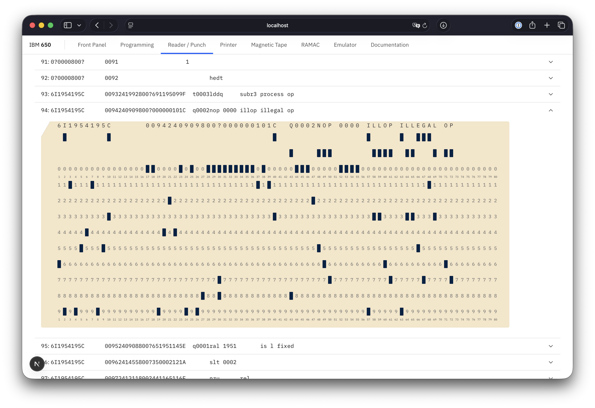

# IBM 650 Simulator UI

This project provides a web-based user interface for the Open SIMH IBM 650 simulator.

⚠️ ***Warning: the code in this repo is a work in progress and is not fully functional yet.***




## Getting Started

### Build the Simulator

This UI is designed to interact with the Open SIMH IBM 650 simulator. Before you use this UI, you'll need to have the simulator compiled and running.

Clone the Open SIMH repository from [https://github.com/open-simh/simh](https://github.com/open-simh/simh), then run `make` in the repo's root directory. 

This works on macOS with the Xcode command line tools installed, and on Linux with build tools installed. It should also work on MSYS2 on Windows with the appropriate packages installed, but I haven't tested it yet.  If you can't get this to work, try the instructions in [README-CMake.md](https://github.com/open-simh/simh/blob/master/README-CMake.md) in the repo.

After successful compilation, the `BIN` directory should contain the simulator executables.

### Start the UI

Set the `SIMH_PATH` environment variable to point to the `BIN` directory of your cloned repo. This allows the UI to locate the simulator.

Run the development server:

```bash
npm run dev
```

Open [http://localhost:3000](http://localhost:3000) with your browser to access the UI.

## About the IBM 650

The [IBM 650](https://en.wikipedia.org/wiki/IBM_650) (wikipedia.org) is an early digital computer produced by IBM in the mid-1950s. It was the first mass-produced computer in the world.

Further reading:

- [The IBM 650](https://www.ibm.com/history/650) (ibm.com)
- [650 Manual of Operation](https://bitsavers.org/pdf/ibm/650/22-6060-2_650_OperMan.pdf) by IBM, 1955 (bitsavers.org)
- [Programming the Magnetic Drum Computer and Data-Processing Machine](https://bitsavers.org/pdf/ibm/650/Andree_Programming_the_IBM_650_Magnetic_Drum_Computer_and_Data-Processing_Machine_1958.pdf) by Richard V. Andree (bitsavers.org)
- [Other IBM 650 Documentation](https://bitsavers.org/pdf/ibm/650/) (bitsavers.org)
- [IBM's Early Computers](https://mitpress.mit.edu/9780262523936/ibms-early-computers/) by Bashe, Pugh, Palmer and Johnson (mitpress.mit.edu)

## About Open SIMH

[Open SIMH](https://opensimh.org) a collection of simulators started by Robert Supnik and developed by a group of volunteers.  It includes simulators for many famous mini- and mainframe computers from the 1950s onwards, and specifically an [IBM 650 simulator](https://opensimh.org/simdocs/i650_doc) by Roberto Sancho.

## About Next.js

This project is built on [Next.js](https://nextjs.org). To learn more, take a look at the following resources:

- [Next.js Documentation](https://nextjs.org/docs) - learn about Next.js features and API.
- [Learn Next.js](https://nextjs.org/learn) - an interactive Next.js tutorial.

You can check out [the Next.js GitHub repository](https://github.com/vercel/next.js) - your feedback and contributions are welcome!

## About Carbon Design System

This project uses the [Carbon Design System](https://carbondesignsystem.com), IBM's open-source design system and React Framework.

## MIT License

Copyright 2026 J.B. Langston

Permission is hereby granted, free of charge, to any person obtaining a copy of this software and associated documentation files (the “Software”), to deal in the Software without restriction, including without limitation the rights to use, copy, modify, merge, publish, distribute, sublicense, and/or sell copies of the Software, and to permit persons to whom the Software is furnished to do so, subject to the following conditions:

The above copyright notice and this permission notice shall be included in all copies or substantial portions of the Software.

THE SOFTWARE IS PROVIDED “AS IS”, WITHOUT WARRANTY OF ANY KIND, EXPRESS OR IMPLIED, INCLUDING BUT NOT LIMITED TO THE WARRANTIES OF MERCHANTABILITY, FITNESS FOR A PARTICULAR PURPOSE AND NONINFRINGEMENT. IN NO EVENT SHALL THE AUTHORS OR COPYRIGHT HOLDERS BE LIABLE FOR ANY CLAIM, DAMAGES OR OTHER LIABILITY, WHETHER IN AN ACTION OF CONTRACT, TORT OR OTHERWISE, ARISING FROM, OUT OF OR IN CONNECTION WITH THE SOFTWARE OR THE USE OR OTHER DEALINGS IN THE SOFTWARE.