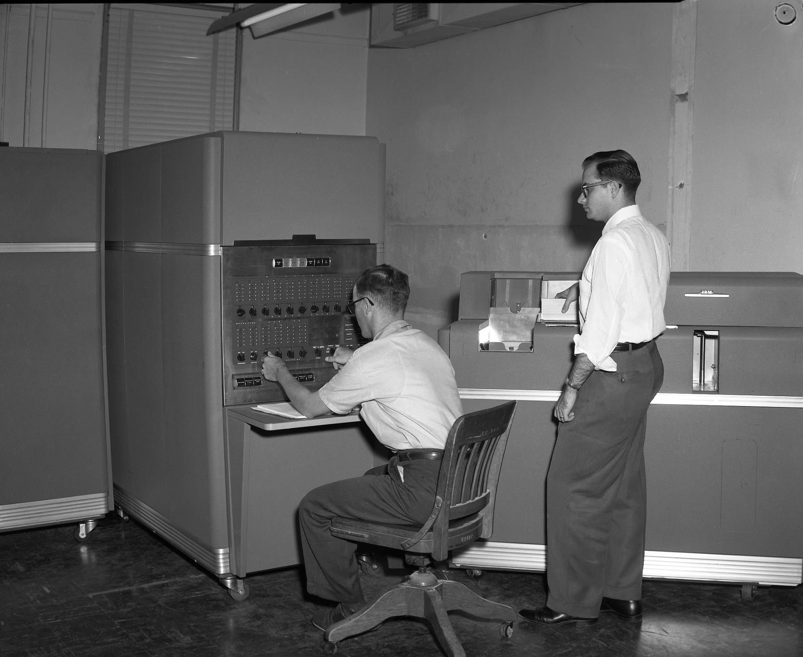

## About the IBM 650

The [IBM 650](https://en.wikipedia.org/wiki/IBM_650) (wikipedia.org) is an early digital computer released by IBM in 1954. It was one of the first mass-produced computers in the world (at a time when just under 2000 was considered mass-produced). It was affordable enough that many universities could afford their own computer for the first time, and it helped launch many computer science programs. It is famously the computer to which Donald Knuth dedicated *The Art of Computer Programming*.

> This series of books is affectionately dedicated to the Type 650 computer once installed at Case Institute of Technology, in rememberance of many pleasant evenings.

-- Donald E. Knuth

Here is a photo of someone other than Donald Knuth using a 650 once installed at [Texas A&M University](https://engineering.tamu.edu/cse/index.html):



Image credit: [Cushing Memorial Library and Archives, Texas A&M](https://www.flickr.com/people/29072716@N04): [IBM Processing Machine](https://www.flickr.com/photos/29072716@N04/3876089106). License: [CC BY-NC-ND 2.0](https://creativecommons.org/licenses/by-nc-nd/2.0/)

## Tutorial

### Front Panel Intro

To get familiar with the front panel, click the HELP button near the bottom right. This will enter context help mode. Everywhere you see a ? cursor, you can click to get contextual help. The best way to learn is to explore.

Here's a quick interactive demo to start your journey:

1. Set the CONTROL switch to MANUAL OPERATION.
2. Set the ADDRESS SELECTION switches to 8000. Click on the right half of the first knob twice to decrement it from 0 to 8.
3. Click the TRANSFER button. The ADDRESS lights should change to display 8000.
4. Enter whatever value you want on the ENTRY - STORAGE switches. You can do this in multiple ways:
   - Turn the knobs by clicking on either side of them.
   - Click on the window displaying the decimal digit to select a value.
   - Click on a switch and then begin typing numbers on the keyboard.
     - The selection will automatically advance to the next switch.
     - Move focus between switches with tab or shift-tab (backspace works too).
5. Set the DISPLAY switch to READ-OUT STORAGE.
6. Press the PROGRAM START button. The value you selected on the ENTRY switches should now be shown on the DISPLAY lights.

### Blinkenlights

The term [blinkenlights](https://en.wikipedia.org/wiki/Blinkenlights) comes from a tongue-in-cheek warning popular in computer rooms of the mainframe and minicomputer era:

> **ACHTUNG!**
>
> ALLES TURISTEN UND NONTEKNISCHEN LOOKENSPEEPERS!
> DAS KOMPUTERMASCHINE IST NICHT FÜR DER
> GEFINGERPOKEN UND MITTENGRABEN! ODERWISE IST EASY
> TO SCHNAPPEN DER SPRINGENWERK, BLOWENFUSEN UND
> POPPENCORKEN MIT SPITZENSPARKEN.
> IST NICHT FÜR GEWERKEN BEI DUMMKOPFEN. DER 
> RUBBERNECKEN SIGHTSEEREN KEEPEN DAS COTTONPICKEN
> HÄNDER IN DAS POCKETS MUSS.
> ZO RELAXEN UND WATSCHEN DER BLINKENLICHTEN.

Luckily, this simulation of the 650 is more friendly to turisten und sightseeren than this warning suggests. Gefingerpoken und mittengrabben is encouraged. You're very unlikely to blowenfusen or schnappen der springenwerk, so have fun. If something breaks, just reload the web page and your virtual 650 is as good as new. 

#### Bi-Quinary Counting

The 650 was introduced at a time in which many of the computing conventions that we take for granted today had not been established. Whether computers should use binary or decimal internally was still up for debate. The 650 was in the decimal camp, and more specifically, it used [bi-quinary](https://en.wikipedia.org/wiki/Bi-quinary_coded_decimal), a 7-bit decimal encoding that includes both a two-state (bi) and a five-state (quinary) component. 

The front panel cleverly arranges the 7 lights for each digit into a 2x5 table with a decimal digit printed at the intersection of each row and column. To read the value of a bi-quinary digit, just look at the number indicated by the lit row and column bulbs. Bi-quinary also has built-in error detecting properties because only very specific combinations of bits are valid.

Go to the Emulator tab, and type the following commands:

```
set throttle 5/1
do /tests/fpcount.ini
```

Switch to the Front Panel tab and enjoy bi-quinary counting at its finest.

#### Blinkenlights while Programs Run

**Before running this, you'll want to set Yield Steps somewhere between 10 and 100.** The setting is under Advanced Options at the bottom of the Emulator tab. Throttling makes the card load stages take too long, but you'll want the emulator to yield to the UI frequently enough for the lights to sample a good amount of the CPU activity.

Try running the test suite:

```
set nothrottle
do /test/i650_test.ini
```

Now, switch back to the Front Panel tab and prepare to be hypnotized.

### Demo Programs

The 650 is fundamentally a batch-oriented computer, which makes its applications amenable to scripting within the simulator. The SIMH 650 simulator comes with many example programs and the scripts to run them, including a single script that will run all of the demos in one go. If you want more Blinkenlights, this script will certainly deliver, but the console output may ultimately prove more interesting to the technically inclined. 

**If you're not planning to watch the front panel, you should set yield steps to 1000 or higher to speed up program execution.** This setting trades frequent front panel updates (lower values) for more processing time (higher values).

To start the demo, run:

```
set nothrottle
cd sw
do i650_demo_all.ini
```

This will begin running all the demo programs.  Output will scroll by in the console output window. If you stick around until the end of the demo script, you are rewarded with some nice punched card plots of mathematical curves:

```
***
*** Run Program
***
         0  1000000000  1000000000  1000000000  1000000000                               10040  
         1   100000000  1000000000          10  1000000000                               20040  
         2    10000000  1000000000              1000000000                               30040  
         3      100000  1000000000                10000000                               40040  
         4         100  1000000000                  100000                               50040  
         5              1000000000                   10000                               60040  
         6               100000000                    1000                               70040  
         7                  100000                     100                               80040  
         8                    1000                     100                               90040  
         9                     100                     100                              100040  
        10                      10                      10                              110040  
        11                     100                     100                              120040  
        12                    1000                     100                              130040  
        13                  100000                     100                              140040  
        14               100000000                    1000                              150040  
        15              1000000000                   10000                              160040  
        16         100  1000000000                  100000                              170040  
        17      100000  1000000000                10000000                              180040  
        18    10000000  1000000000              1000000000                              190040  
        19   100000000  1000000000          10  1000000000                              200040  
        20  1000000000  1000000000  1000000000  1000000000                              210040  

Programmed Stop, IC: 00216 ( 0102160470+   HLT   0216  0470 )
```

You might also have noticed the source code that generated these plots scroll by:

```
C     ------------------------------
C     CARD PUNCH GRAPHICS
C     ------------------------------
C
      PI=3.1415926
      DO 40 I=0,20
C
      A1=(I/20.0)*(2.0*PI)
      A1=COSF(A1)
      A1=INTF(A1*9)
      J=A1
      IF (J) 10,11,12
   10 I1=0
      I2=10**(10+J)
      GO TO 15
   11 I1=0
      I2=10**9
      GO TO 15
   12 I1=10**J
      I2=10**9
      GO TO 15
   15 CONTINUE
C
      A1=100.0-(I-10.0)*(I-10.0)
      A1=SQRTF(A1)
      A1=INTF(9.0-A1*1.8)
      J=A1
      IF (J) 20,21,22
   20 I3=0
      I4=10**(10+J)
      GO TO 25
   21 I3=0
      I4=10**9
      GO TO 25
   22 I3=10**J
      I4=10**9
      GO TO 25
   25 CONTINUE
C
   40 PUNCH,I,I1,I2,I3,I4
      PAUSE
      END
```

 This code is written in [FOR TRANSIT](https://en.wikipedia.org/wiki/FOR_TRANSIT), a subset of FORTRAN for the IBM 650.  It has a three stage compilation process: first, FOR TRANSIT is compiled to Internal Translator, an intermediate language with multiple backeds; next, Internal Translator code is compiled to [Symbolic Optimal Assembly Program](https://en.wikipedia.org/wiki/Symbolic_Optimal_Assembly_Program) (SOAP) assembly; and finally, the SOAP assembly is assembled into optimized 650 machine code.

### Simulator CLI

Before running programs or compiling your own, you'll need to get comfortable with the simulator CLI on the Emulator tab. Basic commands should be familiar to both Unix and Windows users:

- `ls` or `dir` shows the contents of the current directory.
- `cd` navigates the filesystem, where:
  - `/` is the root direcotry
  - `.` is the current directory
  - `..` is the parent directory
  - subdirectories are separated by `/`
- `cat` or `type` displays the contents of any text file, including but not limited to scripts.
- `do` will execute a script. Scripts often end in `.ini` but aren't necessarily required to.

The `/sw/i650_demo_all.ini` script and all the scripts it calls are good places to start looking for practical examples of how to build and run programs.

While exploring the simulator's CLI, keep the following manuals handy:

- [SIMH User's Guide](https://simh.trailing-edge.com/pdf/simh_doc.pdf) (simh.trailing-edge.com). This version is for V3.12-3, but I'm not aware of any official PDF documentation for newer versions of SIMH.
- [All SIMH V3.12-3 documentation](https://simh.trailing-edge.com/pdf/all_docs.html) in PDF format (simh.trailing-edge.com)
- [All SIMH V4.X documentation](https://github.com/open-simh/simh/tree/master/doc) in Word format (github.com/open-simh/simh)
- [IBM 650 simulator documentation](https://opensimh.org/simdocs/i650_doc) (opensimh.org)

### 650 Documentation

I highly recommend [Programming the Magnetic Drum Computer and Data-Processing Machine](https://bitsavers.org/pdf/ibm/650/Andree_Programming_the_IBM_650_Magnetic_Drum_Computer_and_Data-Processing_Machine_1958.pdf) by Richard V. Andree (bitsavers.org) as a general primer on using and programming the 650. It is a lively and informative read, which covers programming in 650 machine code, SOAP, and higher-level languages.

#### Further Reading

- [650 Manual of Operation](https://bitsavers.org/pdf/ibm/650/22-6060-2_650_OperMan.pdf) by IBM, 1955 (bitsavers.org)
- [FOR TRANSIT](http://bitsavers.informatik.uni-stuttgart.de/pdf/ibm/650/28-4028_FOR_TRANSIT.pdf) Reference Manual (bitsavers.org).
- [Internal Translator](https://bitsavers.org/pdf/ibm/650/CarnegieInternalTranslator.pdf) (IT): A Compiler for the 650 (bitsavers.org)
- [SOAP II](https://bitsavers.org/pdf/ibm/650/24-4000-0_SOAPII.pdf) - Symbolic Optimal Assembly Program for the IBM 650 Data Processing System (bitsavers.org)
- [Other IBM 650 Documentation](https://bitsavers.org/pdf/ibm/650/) on bitsavers.org
- [The IBM 650](https://www.ibm.com/history/650) (ibm.com) for IBM's own account of its pioneering computer system.
- [IBM's Early Computers](https://mitpress.mit.edu/9780262523936/ibms-early-computers/) by Bashe, Pugh, Palmer and Johnson (mitpress.mit.edu) for a comprehensive technical and business history of IBM's computing devices from the Hollerith era beginning in the late 1800s to the pre-360 transistor computers of the early 1960s.

## About Open SIMH

[Open SIMH](https://opensimh.org) is a collection of simulators started by Robert Supnik and developed by a group of volunteers.  It includes simulators for many famous mini- and mainframe computers from the 1950s onwards, and specifically an [IBM 650 simulator](https://opensimh.org/simdocs/i650_doc) by Roberto Sancho. Without it, this project could not exist.

### Copyright and License

- Copyright (c) 1993-2022, Robert M Supnik
- Copyright (c) 2018, Roberto Sancho

Permission is hereby granted, free of charge, to any person obtaining a
copy of this software and associated documentation files (the "Software"),
to deal in the Software without restriction, including without limitation
the rights to use, copy, modify, merge, publish, distribute, sublicense,
and/or sell copies of the Software, and to permit persons to whom the
Software is furnished to do so, subject to the following conditions:

The above copyright notice and this permission notice shall be included in
all copies or substantial portions of the Software.

THE SOFTWARE IS PROVIDED "AS IS", WITHOUT WARRANTY OF ANY KIND, EXPRESS OR
IMPLIED, INCLUDING BUT NOT LIMITED TO THE WARRANTIES OF MERCHANTABILITY,
FITNESS FOR A PARTICULAR PURPOSE AND NONINFRINGEMENT.  IN NO EVENT SHALL
ROBERTO SANCHO BE LIABLE FOR ANY CLAIM, DAMAGES OR OTHER LIABILITY, WHETHER
IN AN ACTION OF CONTRACT, TORT OR OTHERWISE, ARISING FROM, OUT OF OR IN
CONNECTION WITH THE SOFTWARE OR THE USE OR OTHER DEALINGS IN THE SOFTWARE.


## About This Project

This web front-end and port of SIMH to Emscripten is by [J.B. Langston](https://www.linkedin.com/in/jblangston/). I happen to work for IBM, but this project is not affiliated with or endorsed by IBM. I made this on my own time for fun. 

### Credits

- [Open SIMH](https://opensimh.org) — simulator core by Robert Supnik and 650 simulator by Roberto Sancho.
- [Emscripten](https://emscripten.org) — compiles SIMH to WebAssembly for in-browser execution.
- [Next.js](https://nextjs.org) — web framework for the UI.
- [React](https://react.dev) — UI component model.
- [Carbon Design System](https://carbondesignsystem.com) — IBM’s open source design system and React components.
- [Vitest](https://vitest.dev) — test runner.
- [Playwright](https://playwright.dev) — end-to-end browser tests.

### AI Disclosure

This project has been developed with the help of AI coding agents. I have used a combination of [Codex](https://chatgpt.com/codex) and [Claude](https://claude.ai/), with some early use of Gemini. For the most part, assume most commits not explicitly co-authored by Claude were probably co-authored by Codex.

All of the SVG graphics have been generated by painstakingly prompting Codex. I am the first to admit I'm not an artist, but I do sweat the details and keep iterating until the agent gets them right.

This documentation is written in my own words without the assistance of AI. Other documents, including developer notes and code reviews have been generated with the help of AI.

### Source Code

The source code for the front panel and SIMH wrapper library is at [github.com/jblang/web650](https://github.com/jblang/web650). This site is deployed directly from the main branch by GitHub actions.

My fork of Open SIMH is at [github.com/jblang/simh](https://github.com/jblang/simh). Currently the changes to make it compile with Emscripten and expose an interface to JavaScript are not upstreamed, so you will need this fork for now if you want to hack on the emulator backend.

### MIT License

Copyright 2026 J.B. Langston

Permission is hereby granted, free of charge, to any person obtaining a copy of this software and associated documentation files (the "Software"), to deal in the Software without restriction, including without limitation the rights to use, copy, modify, merge, publish, distribute, sublicense, and/or sell copies of the Software, and to permit persons to whom the Software is furnished to do so, subject to the following conditions:

The above copyright notice and this permission notice shall be included in all copies or substantial portions of the Software.

THE SOFTWARE IS PROVIDED "AS IS", WITHOUT WARRANTY OF ANY KIND, EXPRESS OR IMPLIED, INCLUDING BUT NOT LIMITED TO THE WARRANTIES OF MERCHANTABILITY, FITNESS FOR A PARTICULAR PURPOSE AND NONINFRINGEMENT. IN NO EVENT SHALL THE AUTHORS OR COPYRIGHT HOLDERS BE LIABLE FOR ANY CLAIM, DAMAGES OR OTHER LIABILITY, WHETHER IN AN ACTION OF CONTRACT, TORT OR OTHERWISE, ARISING FROM, OUT OF OR IN CONNECTION WITH THE SOFTWARE OR THE USE OR OTHER DEALINGS IN THE SOFTWARE.
